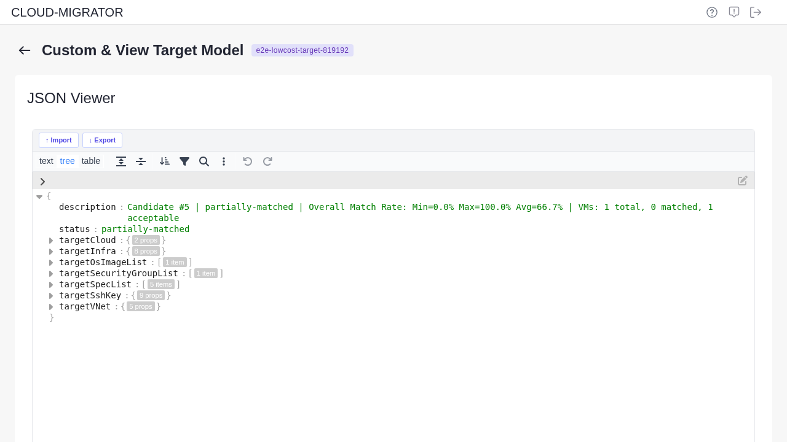
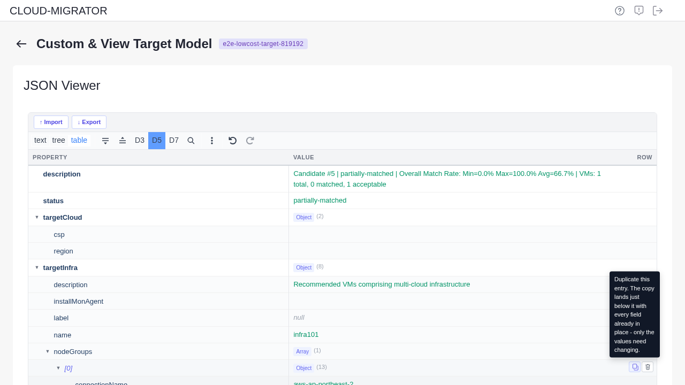
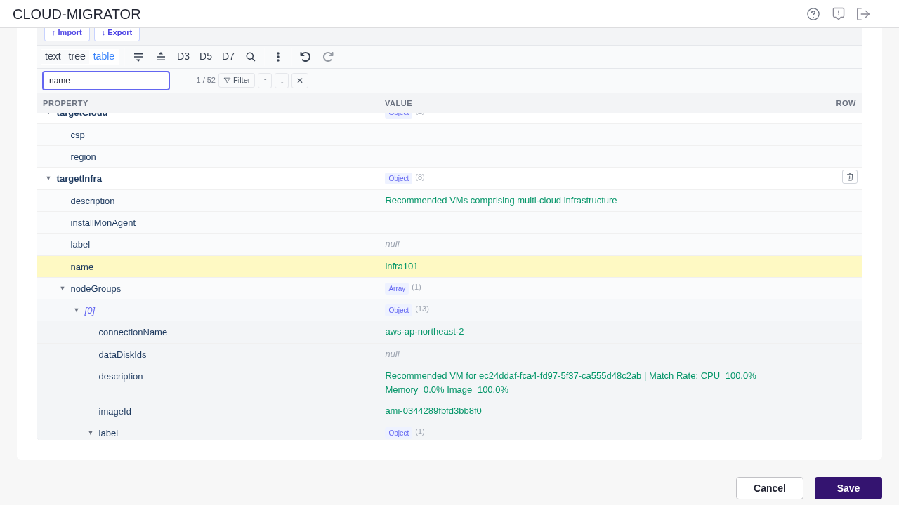
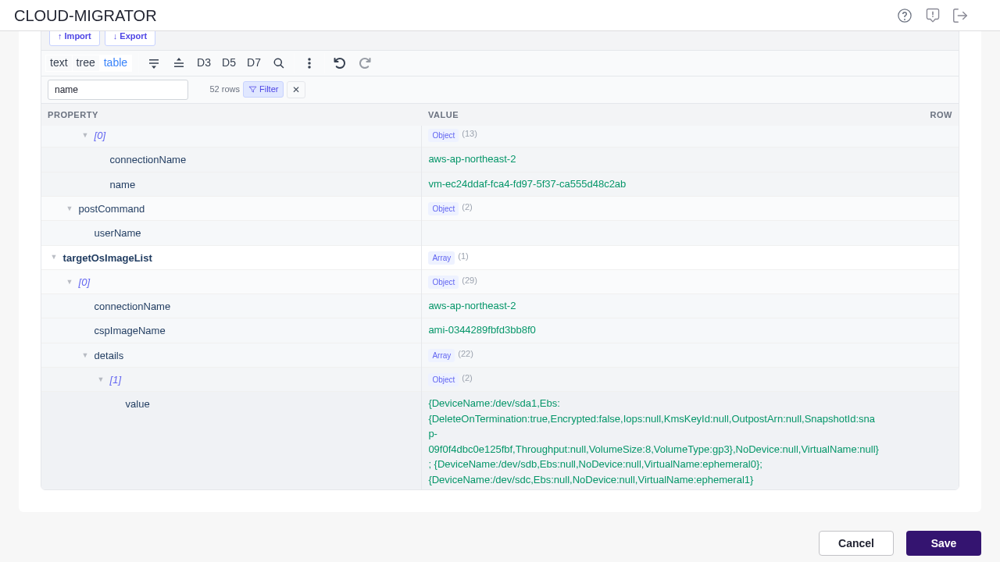
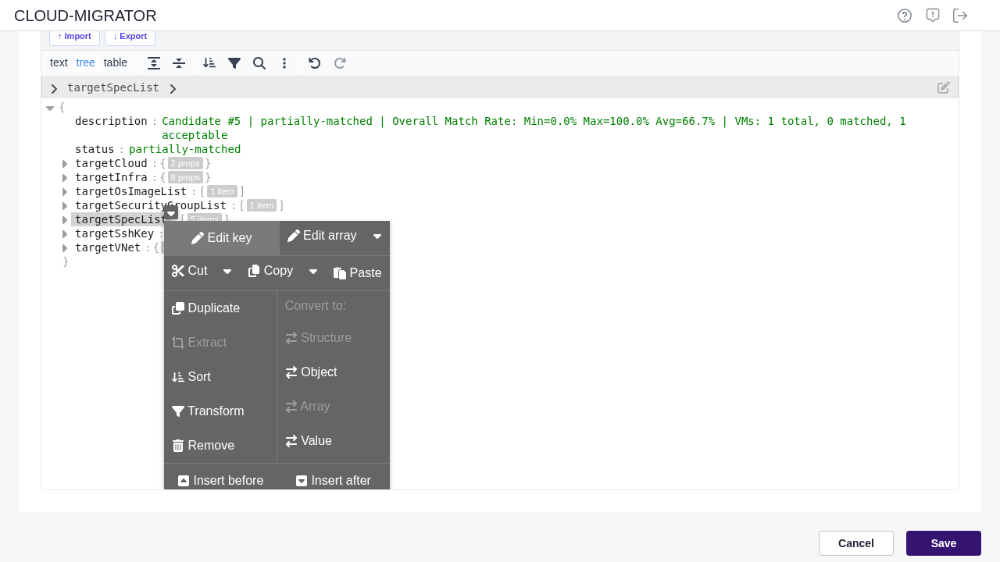
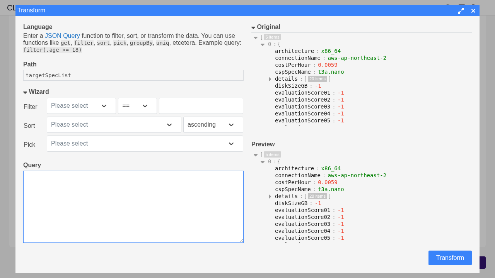
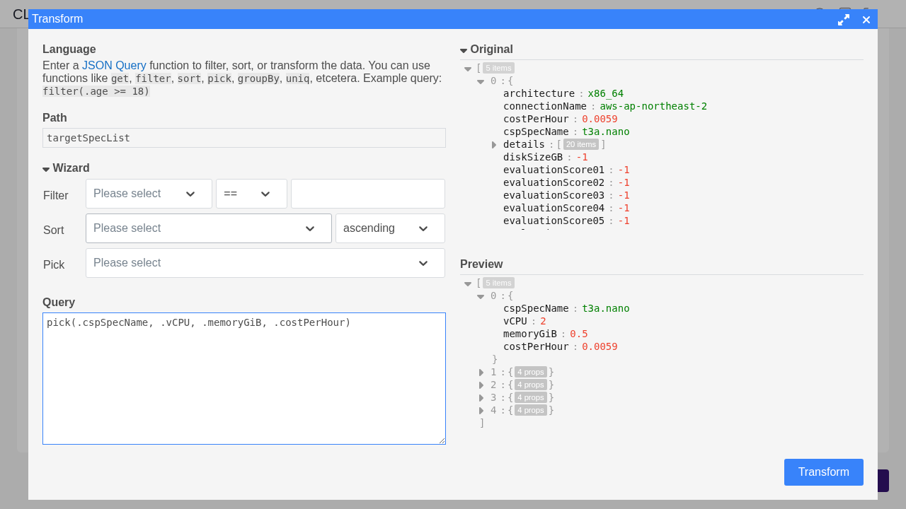
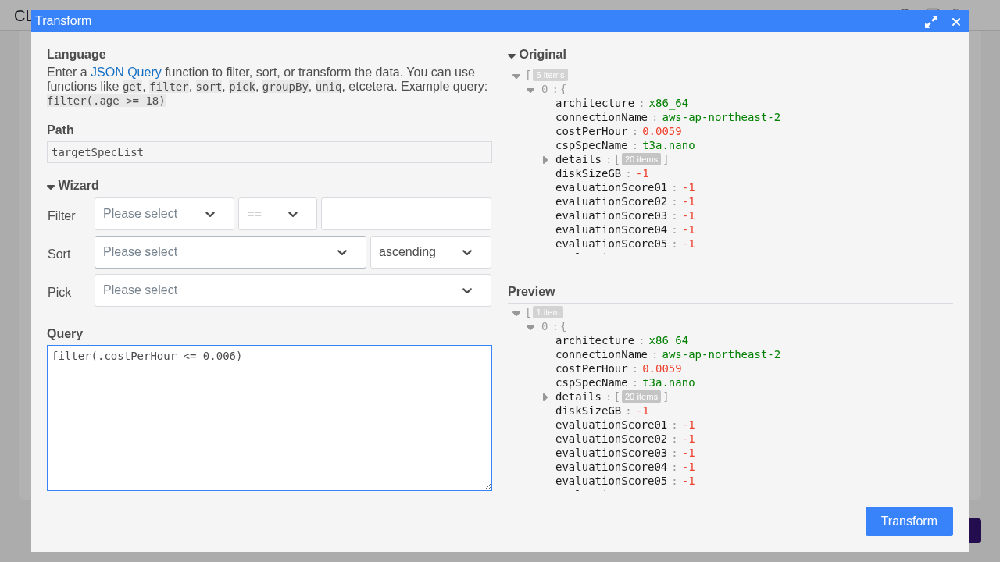
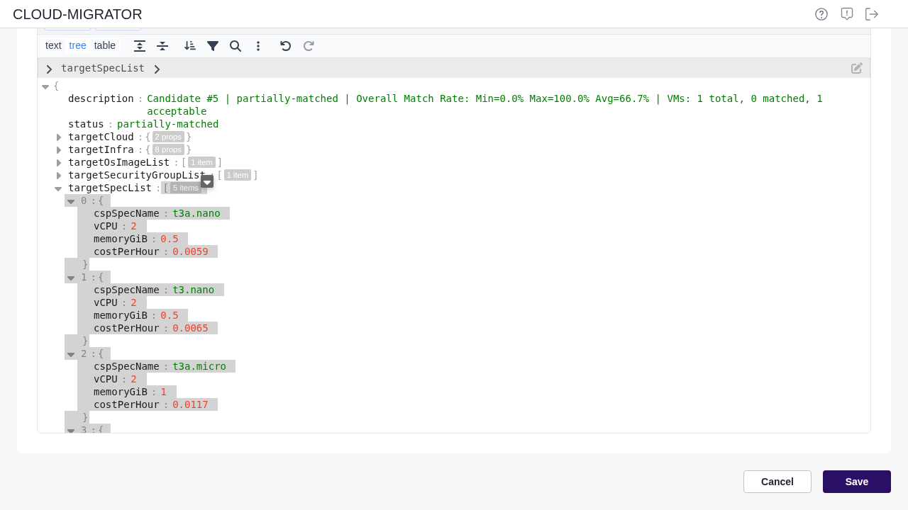

# Editing a Model as JSON

Every model and workflow in the console is a JSON document, and the same editor opens
wherever one of them is shown — source models, target models, workflows, task
components, and the JSON collected from a source server.

This guide is about the parts of that editor which are easy to miss: **adding an entry
to a list**, **finding one name among hundreds**, and **filtering or reshaping an array**
so you can see what you came for.

---

## Three views of the same document

The row at the top left switches between them. It is the same document in all three —
nothing is lost by moving between views.



| View | Best at | Not for |
|------|---------|---------|
| **table** | Reading values side by side, changing them, adding or removing list entries | Restructuring the document |
| **tree** | Working on one branch — sorting an array, filtering it, picking fields | Scanning many values at once |
| **text** | Pasting a whole document, or reading it as it is stored | Careful edits — nothing guards the syntax |

Above the views are **Import** and **Export**, which read and write the document as a
file. Everything else on that row belongs to the editor: expand and collapse, expand to
a depth (3, 5 or 7 levels), search, the context menu, and undo/redo.

**Undo covers everything**, including edits made in the table view. If a change turns
out wrong, `Ctrl+Z` takes it back.

> Sort and transform are shown only in the tree and text views. They act on whatever the
> editor has selected, and the table view makes no selection — see
> [Filtering and reshaping an array](#filtering-and-reshaping-an-array).

---

## Adding an entry to a list

A firewall rule, a node group, a disk — these are entries in an array, and the table
view adds them by **copying an entry you already have**.



1. Switch to **table** and open the list (the arrow beside its name, or **D5** to open
   five levels at once)
2. Hover over the entry you want to base the new one on — two buttons appear on the right
3. Press the **copy** button. The new entry lands directly below, with every field
   already filled in
4. Change the values that need to differ — double-click a value to edit it, `Enter` to
   keep it

The bin button removes an entry.

> The copy button is deliberate: a blank entry would need every field typed from memory,
> and a missing field is not always reported. Copying an entry that already works leaves
> only the differences to fill in.

Both buttons are also on the right-click menu of the row.

---

## Finding one name among many

Press the magnifier (or `Ctrl+F`) in the table view. There are **two ways to search**,
and which one helps depends on what you are doing.

### Stepping through matches — the default

The document stays as it is; matches are highlighted and the box shows where you are.



Use this when you are looking for **one** value. The keys around it are what tell you
what the value is — `name` on its own means little, `name` under `nodeGroups[0]` means a
great deal.

The arrows move to the next and previous match, and branches open on the way, so a value
buried five levels down is found and shown without any hunting.

### Filtering — only the matching rows

Press **Filter** in the search bar and everything else disappears.



Use this when the **same name runs through the document and all of it has to change** —
say `vm1` appears in a node group, a security group and a spec, and every one of them
needs a new name. Stepping means pressing the arrow a hundred times; filtering puts the
hundred rows in front of you.

The rows above a match stay on screen so you can still tell where each one sits. The
count changes from `3 / 52` to `52 rows`, and pressing **Filter** again brings the whole
document back.

---

## Filtering and reshaping an array

The tree view has two more tools — **sort** and **transform**. Both work on one array at a
time, so **choose the array before you use them.**

### Select the array first

Click the name of the array — `targetSpecList`, `nodeGroups`, `firewallRules` — so the row
is highlighted. Then right-click it (or press `Ctrl+Q`).



**Sort** and **Transform** are now enabled, and they act on the array you picked. The
wizard offers that array's fields to filter, sort and pick by.

### The transform window



* **Path** shows which array will be transformed. To work on a different one, close the
  window, select that array, and open it from its right-click menu
* **Wizard** builds the query for you: filter by a field, sort by a field, pick fields to
  keep
* **Query** is the same thing written out. The language is
  [JSON Query](https://jsonquerylang.org) — `filter`, `sort`, `pick`, `get`, `groupBy`,
  `uniq`
* **Original** and **Preview** show the array before and after. **Nothing changes until
  you press Transform**

### Examples on a target model

The recommended specs (`targetSpecList`) carry about thirty fields each, most of them
irrelevant to the decision you are making.

**Keep only the fields worth comparing**

```
pick(.cspSpecName, .vCPU, .memoryGiB, .costPerHour)
```



The preview goes from thirty fields per entry to four, and the specs can be read side by
side.

**Keep only the entries that qualify**

```
filter(.costPerHour <= 0.006)
```



*Original: 5 items. Preview: 1 item — the only spec under that price.*

**Order by cost**

```
sort(.costPerHour)
```

Add `'desc'` for the other direction: `sort(.costPerHour, 'desc')`.

### Transform replaces the data



*The pick, applied. Five specs, four fields each, side by side.*

Pressing **Transform** does not open a separate view — it **replaces that array in the
document** with the result. That is what you want when you are reshaping a model on
purpose, and not what you want when you were only looking.

If you were only looking, press `Ctrl+Z` afterwards. And check the document before
saving: a model saved after a filter keeps only the entries that survived it.

---

## Files in and out

**Export** writes what the screen is showing to a file. **Import** reads one back.

Use it to edit a large document in a text editor, to keep a model you may want again, or
to start a new model from one that already works.

Two things to know:

* The file holds **what the screen shows**, not the whole server record. Models are
  stored inside a wrapper (`cloudInfraModel`, `targetSoftwareModel`), and the screen
  shows the inside — so does the file. It is meant to come back through **Import**, not
  to be posted to an API
* Screens differ in what they open. The source model screen edits the node list, so its
  file is an **array**; the target model screens edit an object. A file from one screen
  will not fit the other

**Import replaces the document; it does not merge.** Saving afterwards is what makes it
permanent — and on the model screens, saving creates a **new** custom model under a name
you give, leaving the original untouched.

---

## When pasting is refused

Pasting from the right-click menu asks the browser for the clipboard, and the browser may
refuse. **Use `Ctrl+V` instead** — a keyboard paste carries the clipboard with it, so the
browser has nothing to ask about.

---

## Related

* [Quick start: a migration from beginning to end](quick-start-migration.md)
* [Reading the run status screen](workflow-run-status.md)
* [Running workflow tasks in parallel](workflow-parallel-steps.md)
